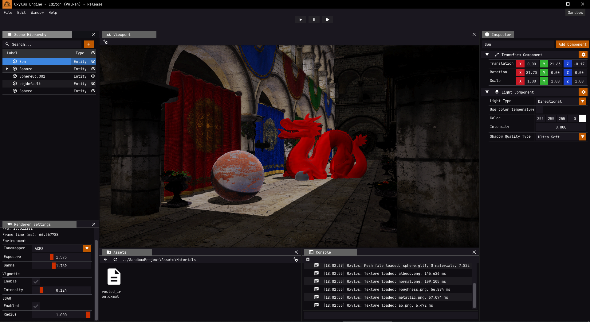

My own engine I have been working on since 2022-06 in my free time. It first started as an OpenGL playground for me to learn graphics and systems programming but then I realised I won't go far with OpenGL and switched my whole engine to Vulkan in a month. And I started working on it more seriously instead of just treating it as a playground. Now it is a fully capable engine with an editor of creating good looking games with the complex renderer using techniques like Tiled Forward Rendering, PBR, PCF Shadows, SSAO, Bloom etc..

