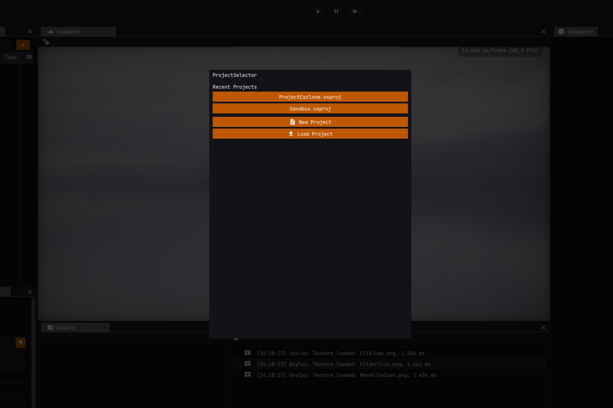
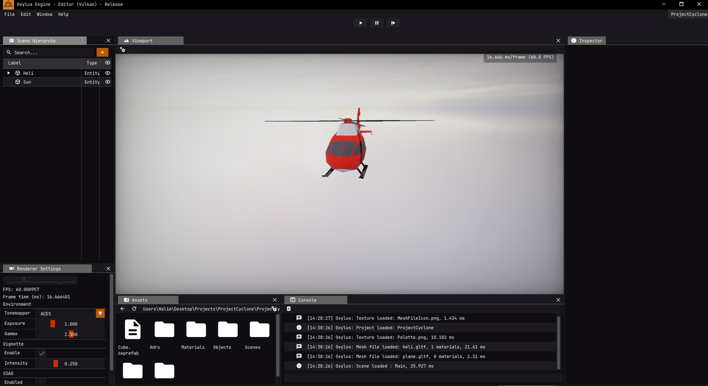
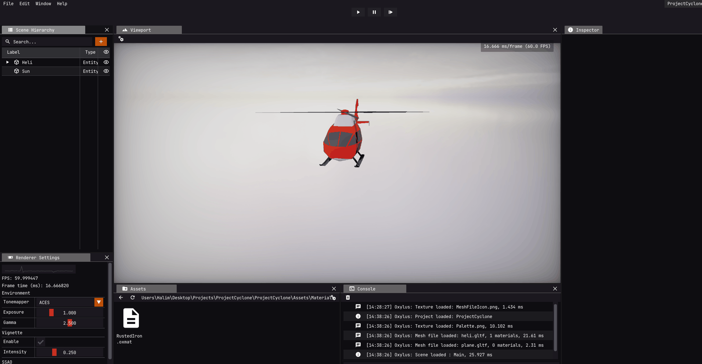

For the purpose of testing Oxylus' capabilities and identifying any missing features, I have decided to make a game using the engine. This project will serve as a stress test to see how well the engine can handle complex gameplay scenarios, while also providing an opportunity to showcase its current features. Furthermore, while working on the game, I'll be able to spot any features that are missing or need improvement. This way, I can add them to the engine and make it even better!

The game I chose to remake in 3D is [1985 Cyclone](<https://en.wikipedia.org/wiki/Cyclone_(video_game)>). It looked simple and is enough to showcase almost all features of the engine.

In this blog post I will show the steps I took to create the game, similar to a tutorial you might find for popular engines like Unity, Unreal or etc.

So let us begin...

## Project

The project selection panel is the first thing you will see when launching the engine. The top rows displays recent projects that have been opened, and below that are buttons to load or create projects with a file dialog.


In Oxylus, a project is simply a YAML file that specifies the project name, starting scene path, and asset directory:

```yml
Project:
  Name: ProjectCyclone
  StartScene: "Scenes/Main.oxscene"
  AssetDirectory: "Assets"
```

## Scene

First of all, we need assets to load for our scene. I found a nice [helicopter model](https://sketchfab.com/3d-models/low-poly-helicopter-5bbed2de9baa4a13a7faa72653b78b64)
from Sketchfab. To import assets into Oxylus, simply download the asset and drag and drop it into the editor. Oxylus will automatically load all meshes and materials and create parented entities based on the glTF node hierarchy.


To create ground in the game, I used a plane and applied a green material to it. I created the material first, then simply draged and dropped it onto the plane in the editor.


## Systems

One of the most useful features of editing scenes in Oxylus is the ability to see the results immediately during runtime. To achieve this, I implemented the `HotReloadableScene` system using the Oxylus Systems and Event System. With `HotReloadableScene`, you can make changes to a scene and see the changes take effect in real-time, making the editing process much faster and more efficient.

Systems in Oxylus are inherited from the `System` interface.

```cpp
class System {
public:
  std::string Name;
  System() = default;
  System(std::string name) : Name(std::move(name)) {}
  virtual ~System() = default;
  virtual void OnInit() {};
  virtual void OnUpdate() {}
  virtual void OnUpdate(Scene* scene) {}
  virtual void OnShutdown() {};
  void SetDispatcher(EventDispatcher* dispatcher) { m_Dispatcher = dispatcher; }
protected:
  EventDispatcher* m_Dispatcher = nullptr;
};
```

Defining the `HotReloadableScene` system:

```cpp
void HotReloadableScenes::OnUpdate() {
  using namespace std::filesystem;
  if (last_write_time(m_ScenePath).time_since_epoch().count()
      != m_LastWriteTime.time_since_epoch().count()) {
    //File changed event
    m_Dispatcher->trigger<ReloadSceneEvent>();
    m_LastWriteTime = last_write_time(m_ScenePath);
  }
}
```

`m_Dispatcher->trigger<ReloadSceneEvent>();` is the way to simply trigger the `ReloadSceneEvent`.

The `OnAttach` callback on the `GameLayer` listens for the system event:

```cpp
void GameLayer::OnAttach(EventDispatcher& dispatcher) {
  dispatcher.sink<ReloadSceneEvent>().connect<&GameLayer::OnSceneReload>(*this);
}

bool GameLayer::OnSceneReload(ReloadSceneEvent&) {
  LoadScene();
  OX_CORE_INFO("Scene reloaded.");
  return true;
}
```

Next, we add the system to the engine during the application creation process:

```cpp
const auto app = new ProjectCyclone(spec);
app->PushLayer(new ::ProjectCyclone::GameLayer())
    .AddSystem<HotReloadableScenes>("Assets/Scenes/Main.oxscene");
```


## Gameplay

Now we can move onto the fun part of game development and prove wrong the infamous phrase about engine developers 😛:

> Give someone an engine and they'll make a game. Teach someone to make an engine and they'll never make anything.

I started by creating a simple helicopter system to move the helicopter and make the propellers turn around itself.

We could have used the `ScriptableEntity` approach, but instead, I opted for the "raw" ECS method as I did not require any callbacks from the `ScriptableEntity` API.

The component that will be added on helicopter entity:

```cpp
struct HeliComponent {
  float Speed = 5.0f;
  float Fuel = 1.0f;  //1.0f = Full, 0.0f = Empty
  float Altitude = 0.0f;
};
```

Using the same method as we used to declare the engine system in the previous section, we can now declare a system for the Helicopter entities.

```cpp
void HeliSystem::OnUpdate(Scene* scene) {
  auto& registery = scene->m_Registry;
    const auto view = registery.view<TransformComponent, HeliComponent>();
    for (const auto entity : view) {
      auto&& [transform, heli] = view.get<TransformComponent, HeliComponent>(entity);

      //Move horizontal
      if (Input::GetKeyDown(Key::W)) {
        transform.Translation.z += heli.Speed * Timestep::GetDeltaTime();
      }
      //...
      //Other keys
      //...

      //Move vertical
      if (Input::GetKeyDown(Key::Q) && heli.Altitude >= 0.2f) {
        transform.Translation.y -= heli.Speed * Timestep::GetDeltaTime();
      }
      else if (Input::GetKeyDown(Key::E) && heli.Altitude < 8.0f) {
        transform.Translation.y += heli.Speed * Timestep::GetDeltaTime();
      }

      heli.Fuel -= 0.1f * ImGui::GetIO().DeltaTime;
      heli.Altitude = transform.Translation.y;
  }
}
```

For rotating the propeller just getting the transform component and adding a constant value to `y` rotation should work for now.

```cpp
auto ent = Oxylus::Entity { entity, m_Scene.get() };
ent.GetChild(1).GetComponent<Oxylus::TransformComponent>().Rotation.y += 5.0f;
```

Other gameplay elements that could be added include picking up crates from the ground. Similar to how we created the helicopter system, we can now create a system for the crates.

```cpp
const auto heliView = scene->m_Registry.view<TransformComponent, HeliComponent>();
const auto crateView = scene->m_Registry.view<TransformComponent, CrateComponent>();
for (const auto entity : crateView) {
  auto&& [transform, crate] = crateView.get<TransformComponent, CrateComponent>(entity);
  const auto ent = Entity{entity, scene};
  constexpr float axisThreshold = 0.5f;
  //a simple intersection check
  for (const auto heliEntity : heliView) {
    auto&& [heliTransform, heli] = heliView.get<TransformComponent, HeliComponent>(heliEntity);
    if (std::abs(transform.Translation.x - heliTransform.Translation.x) < axisThreshold
        && std::abs(transform.Translation.y + 0.2f - heliTransform.Translation.y) < axisThreshold
        && std::abs(transform.Translation.z - heliTransform.Translation.z) < axisThreshold) {
      heli.CratesTaken += 1;
      scene->DestroyEntity(ent);
      break;
    }
  }
}
```


As you may have noticed, the camera is currently static. Since the player will be moving around frequently, we want to ensure that the helicopter remains in focus. Simply snapping the camera to a predefined position whenever the player moves would not look good. Therefore, we can utilize the `OxMath` API to create a camera system with smooth damping that produces more visually pleasing result.

```cpp
m_LastCameraPosition = Math::SmoothDamp(m_LastCameraPosition,
                                        heliTransform.Translation,
                                        m_TranslationVelocity,
                                        TranslationDampening,
                                        10000.0f,
                                        Timestep::GetDeltaTime());
cameraTransform.Translation.x = m_LastCameraPosition.x;
cameraTransform.Translation.z = m_LastCameraPosition.z + 12.0f;
```


## UI

To create the game UI, we can use the `OxUI` API which is built on top of `Dear ImGui` for drawing and layouts. In Cyclone, we need a HUD that displays instrumentation such as speed, altitude, fuel remaining and time remaining. We'll also show the number of supply crates, the player's current view direction, wind force, and a warning about the cyclone's proximity and any approaching planes. For simplicity, we'll start with showing altitude, remaining fuel, and time.

```cpp
OxUI::BeginUI();
OxUI::ProgressBar("Time", Time);
OxUI::ProgressBar("Fuel", Heli.Fuel);
OxUI::Property("Altitude", "%.1f", Heli.Altitude);
OxUI::EndUI();
```


To keep track of the collected crates, we can simply use glyphs as icons in a row:

```cpp
ImGui::Text(StringUtils::FromChar8T(ICON_MDI_CUBE));
```


# TO BE CONTINUED...
